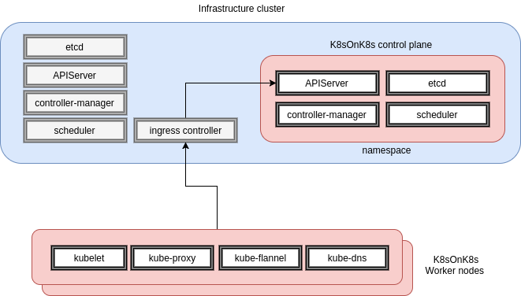

# k8s-on-k8s

This project aims to build k8s _control planes_ on demand using an existing k8s
cluster so you can easily test new versions, features or networking drivers without
having to wait for an installer to support it.

It can also be used for teaching purposes giving every student a control plane
using as little resources as what a few _hyperkube_ and _etcd_ PODs consume.


Theory of operation
--------------

A _master_ or _infrastructure_ cluster provides control plane as a service to multiple
delegated cluster administrators by granting each of them a writable namespace.

The Kubernetes _hosted_ control plane is provisioned in that namespace just like any
common containerized application using deployments, services and ingress native objects.

The cluster administrator can then connect his worker nodes to that control plane
and create the necessary RBAC bindings for his consumers with no change to the
infrastructure cluster.

A basic script creates the control plane for now but later a CRD will define the
desired control plane and an operator will do the heavy lifting.




Current state
--------------
It's a WIP... a lot remains to be done.  For now you get:
* A single etcd member with no persistence (until setup with operator)  
* A k8s control plane with RBAC enabled (API server, controller-manager and scheduler)
* Kubeconfig files for the hosted cluster administrator and to connect kubelets
* Flannel and kube-proxy daemon-sets to be instantiated on workers
* Kube-dns on the first worker joining the cluster

Also note this _10.199.199.199_ IP advertised in the API server manifest and setup
locally on each worker's loopback interface as show below.  This is a work around for in-cluster
clients using the built-in kubernetes service to reach the API server (such as kube-flannel
and kube-dns PODs) via a nodePort service.

TODO:
* Replace script  by an operator and TPRs/CRDs
* Store TLS assets as encrypted secrets (requires 1.7 infra cluster)
* Use CoreOS etcd operator with persistent volumes
* Add mini ELK stack to visualize control plane logs
* Bridge authn/authz to external source
* Test with additional network drivers such as Cilium, Weave and Romana


Local requirements to deploy _hosted_ control planes
--------------
* cfssl
* kubectl setup with the infrastructure cluster context


K8s Infrastructure requirements
--------------
* Access to a writable namespace
* A functional ingress controller on the infra cluster


Creating the hosted control plane
--------------
Specify the desired API URL hostname that must resolve and route to the infrastructure
cluster's ingress controller. This could be as a CNAME to the ingress controller
of the infrastructure cluster.


```
$ ./deploy.sh -h kubernetes.foo-bar.com -n namespaceX
CHECK: Access to cluster confirmed
CHECK: API server host kubernetes.foo-bar.com resolves
2017/07/25 08:31:46 [INFO] generating a new CA key and certificate from CSR
2017/07/25 08:31:46 [INFO] generate received request
2017/07/25 08:31:46 [INFO] received CSR
2017/07/25 08:31:46 [INFO] generating key: rsa-2048
2017/07/25 08:31:46 [INFO] encoded CSR
2017/07/25 08:31:46 [INFO] signed certificate with serial number 343368285204006686908415438394591991039302384146
2017/07/25 08:31:46 [INFO] generate received request
2017/07/25 08:31:46 [INFO] received CSR
2017/07/25 08:31:46 [INFO] generating key: rsa-2048
2017/07/25 08:31:47 [INFO] encoded CSR
2017/07/25 08:31:47 [INFO] signed certificate with serial number 634677056508179731833979679679719784750411028857
2017/07/25 08:31:47 [INFO] generate received request
2017/07/25 08:31:47 [INFO] received CSR
2017/07/25 08:31:47 [INFO] generating key: rsa-2048
2017/07/25 08:31:47 [INFO] encoded CSR
2017/07/25 08:31:47 [INFO] signed certificate with serial number 34772891780328732259434788313932796585661614421
...
secret "kube-apiserver" created
secret "admin-kubeconfig" created
secret "kube-controller-manager" created
secret "kube-scheduler" created
deployment "etcd" created
service "etcd0" created
deployment "kube-apiserver" created
ingress "k8s-on-k8s" created
service "apiserver" created
deployment "kube-controller-manager" created
deployment "kube-scheduler" created
Giving a few seconds for the API server to start...
Trying to connect to the hosted control plane...
......AVAILABLE !
Client Version: version.Info{Major:"1", Minor:"7", GitVersion:"v1.7.1", GitCommit:"1dc5c66f5dd61da08412a74221ecc79208c2165b", GitTreeState:"clean", BuildDate:"2017-07-14T02:00:46Z", GoVersion:"go1.8.3", Compiler:"gc", Platform:"linux/amd64"}
Server Version: version.Info{Major:"1", Minor:"7", GitVersion:"v1.7.2", GitCommit:"922a86cfcd65915a9b2f69f3f193b8907d741d9c", GitTreeState:"clean", BuildDate:"2017-07-21T08:08:00Z", GoVersion:"go1.8.3", Compiler:"gc", Platform:"linux/amd64"}
Deploying child cluster assets
secret "kubeconfig-proxy" created
daemonset "kube-proxy" created
clusterrole "flannel" created
clusterrolebinding "flannel" created
serviceaccount "flannel" created
configmap "kube-flannel-cfg" created
daemonset "kube-flannel-ds" created
configmap "kube-dns" created
deployment "kube-dns" created
serviceaccount "kube-dns" created
service "kube-dns" created
```


Connecting a kubelet manually
--------------

Tested on a CoreOS instance

Note: Update the _k8s-socat.service_ unit to point to your API server nodePort

```
# mkdir /etc/kubernetes/tls -p

--> Upload kubeconfig-kubelets and ca.pem files under /etc/kubernetes/tls

MYIP=$(ip route list scope global | awk '{print $9}')
cat <<EOF>/etc/systemd/system/kubelet.service
[Unit]
Description=Kubernetes node agent
[Install]
WantedBy=multi-user.target
[Service]
Environment=KUBELET_IMAGE_TAG=v1.7.2_coreos.0
Environment="RKT_RUN_ARGS=--uuid-file-save=/var/run/kubelet-pod.uuid \
  --volume etc-cni,kind=host,source=/etc/cni,readOnly=false \
  --mount volume=etc-cni,target=/etc/cni \
  --dns=host"
ExecStartPre=-/bin/mkdir -p /etc/cni/net.d
ExecStartPre=-/usr/bin/rkt rm --uuid-file=/var/run/kubelet-pod.uuid
ExecStart=/usr/lib/coreos/kubelet-wrapper \
  --allow-privileged --require-kubeconfig  \
  --kubeconfig /etc/kubernetes/tls/kubeconfig-kubelets \
  --cni-conf-dir=/etc/cni/net.d --network-plugin=cni \
  --cluster-dns=10.3.0.10 --cluster_domain=cluster.local \
  --hostname-override=${MYIP}
ExecStop=-/usr/bin/rkt stop --uuid-file=/var/run/kubelet-pod.uuid
EOF

cat <<EOF> /etc/systemd/system/k8s-socat.service
[Unit]
Description=Kubernetes API socat
[Install]
WantedBy=multi-user.target
[Service]
ExecStartPre=-/usr/bin/ip addr add 10.199.199.199/32 dev lo
ExecStart=/usr/bin/docker run --rm --net=host \
    alpine/socat TCP-LISTEN:443,fork,reuseaddr,bind=10.199.199.199 TCP:testjfn.k8s.cloudsys.tmcs:30648
EOF

systemctl daemon-reload
systemctl enable kubelet k8s-socat
systemctl restart kubelet k8s-socat
```


Using the _hosted_ cluster resources
--------------

A _kubeconfig_ file with admin privileges was created under the tls directory.

Use it to perform administrator tasks and to create the additional
RBAC bindings for the end user (if any but you !)


```
$ kubectl --kubeconfig=tls/kubeconfig get nodes
NAME            STATUS    AGE       VERSION
192.168.1.124   Ready     13m       v1.7.2+coreos.0
192.168.1.125   Ready     13m       v1.7.2+coreos.0
```

```
$ kubectl --kubeconfig=tls/kubeconfig get pods -n kube-system -o wide
NAME                        READY     STATUS    RESTARTS   AGE       IP              NODE
kube-dns-2177165803-19jgj   3/3       Running   0          3m        10.2.0.2        192.168.1.125
kube-flannel-ds-29nwm       2/2       Running   1          3m        192.168.1.124   192.168.1.124
kube-flannel-ds-btlg7       2/2       Running   1          3m        192.168.1.125   192.168.1.125
kube-proxy-fz6s5            1/1       Running   0          3m        192.168.1.125   192.168.1.125
kube-proxy-jtfk4            1/1       Running   0          3m        192.168.1.124   192.168.1.124

```


Delete hosted k8s resources
--------------
```
kubectl -n namespaceX delete deployment,svc,secrets,ingress --all
```
